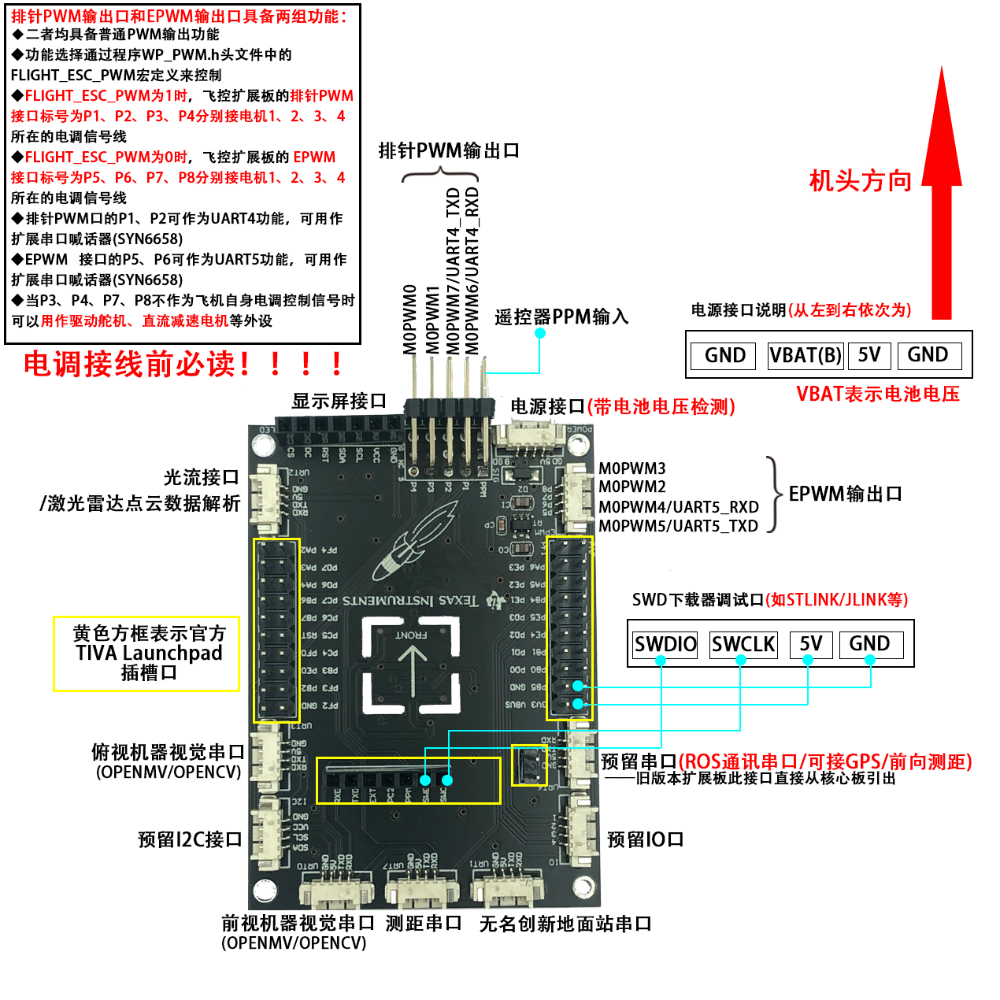
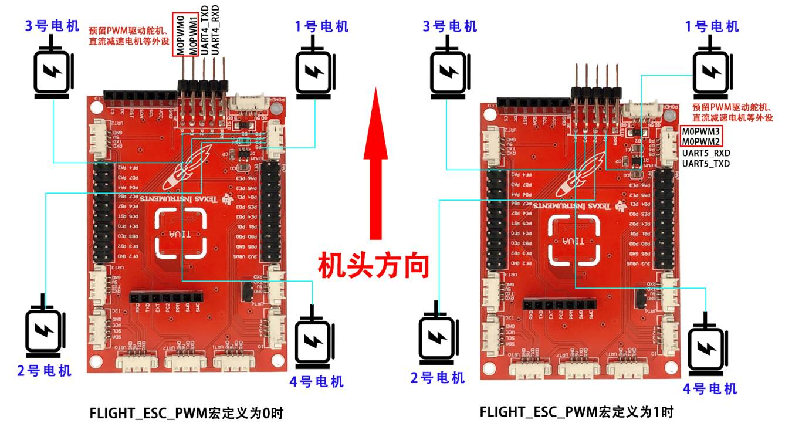

# TIVA LaunchPad V2版本飞控代码阶段性更新日志：

## **20220805主要更新如下**

### 1、增加了2022年7月TI省赛B题送货无人机赛题的支持

赛题要求第一部分：2022年TI电赛B题—送货无人机开源方案NC360深度开源竞赛无人机开发平台

https://www.bilibili.com/video/BV1PB4y1t7eM/?vd_source=fa3e626a57e95e09ecf1b8f1627e58ac

赛题要求第二部分：TI电赛飞行器-B题送货无人机模板目标特征学习

https://www.bilibili.com/video/BV1kg411C76u/?vd_source=fa3e626a57e95e09ecf1b8f1627e58ac

赛题要求第三部分：任意位置、角度自主飞行穿越圆框——2022年TI电赛飞行器B题送货无人机

https://www.bilibili.com/video/BV14S4y1474j/?vd_source=fa3e626a57e95e09ecf1b8f1627e58ac

- 针对赛题内容需要**驱动舵机或者减速电机**，对PWM资源进行了重新分类，**预留两路PWM**用于驱动舵机、减速电机等执行机构。

- 同时将原来预留四路PWM中的**两路资源删除掉了**，**新增加了一路串口资源UART4/UART5**，此串口资源可以**接串口语音模块外接功放喇叭实现喊话器**的功能，**通过WP_PWM.h头文件中的FLIGHT_ESC_PWM宏定义控制。**

  

  //飞控电调所接PWM来源
  #define FLIGHT_ESC_PWM  0//**0:使用EPWM、1:使用排针PWM**

  | 飞控扩展板上标号 | 单片机引脚号 | 单片机PWM资源通道 |   第二功能   |
  | :--------------: | :----------: | :---------------: | :----------: |
  |        P1        |     PC4      |      M0PWM6       |  UART4_RXD   |
  |        P2        |     PC5      |      M0PWM7       |  UART4_TXD   |
  |        P3        |     PB7      |      M0PWM1       | 预留PWM通道1 |
  |        P4        |     PB6      |      M0PWM0       | 预留PWM通道2 |
  |        P5        |     PE5      |      M0PWM5       |  UART5_TXD   |
  |        P6        |     PE4      |      M0PWM4       |  UART5_RXD   |
  |        P7        |     PB4      |      M0PWM2       | 预留PWM通道1 |
  |        P8        |     PB5      |      M0PWM3       | 预留PWM通道2 |

  FLIGHT_ESC_PWM  **宏定义为0，飞控电调信号使用EPWM接口**
  飞控扩展板的EPWM接口标号为P5、P6、P7、P8分别接电机1、2、3、4所在的电调信号线

  | 电调/舵机信号序号 | 飞控扩展板上标号 | 单片机引脚号 | 单片机PWM资源通道 |
  | :---------------: | :--------------: | :----------: | :---------------: |
  |      MOTOR1       |        P5        |     PE5      |      M0PWM5       |
  |      MOTOR2       |        P6        |     PE4      |      M0PWM4       |
  |      MOTOR3       |        P7        |     PB4      |      M0PWM2       |
  |      MOTOR4       |        P8        |     PB5      |      M0PWM3       |
  | **预留PWM通道1**  |      **P3**      |   **PB7**    |    **M0PWM1**     |
  | **预留PWM通道2**  |      **P4**      |   **PB6**    |    **M0PWM0**     |

  1. 两个通道预留PWM分别为**排针PWM接口的P3、P4**
  2. 排针PWM接口的P1、P2被用作**串口资源的UART4_RXD、UART_TXD**

  

  FLIGHT_ESC_PWM **宏定义为1，飞控电调信号使用排针PWM接口**
  飞控扩展板的排针PWM接口标号为P1、P2、P3、P4分别接电机1、2、3、4所在的电调信号线

  | 电调/舵机信号序号 | 飞控扩展板上标号 | 单片机引脚号 | 单片机PWM资源通道 |
  | :---------------: | :--------------: | :----------: | :---------------: |
  |      MOTOR1       |        P1        |     PC4      |      M0PWM6       |
  |      MOTOR2       |        P2        |     PC5      |      M0PWM7       |
  |      MOTOR3       |        P3        |     PB7      |      M0PWM1       |
  |      MOTOR4       |        P4        |     PB6      |      M0PWM0       |
  | **预留PWM通道1**  |      **P7**      |   **PB4**    |    **M0PWM2**     |
  | **预留PWM通道2**  |      **P8**      |   **PB5**    |    **M0PWM3**     |

  1. 两个通道**预留PWM**分别为**EPWM接口的P7、P8**
  2. EPWM接口接口的**P5、P6被用作串口资源的UART5_TXD、UART5_RXD**

- 针对赛题中需要在比赛现场通过**板载按键来对目标作业点坐标进行配置**，在OLED显示屏上新加了相关配置UI界面，配合TIVA核心板上的按键上一页、下一页**长按实现对相关参数进行调整**。同理也可以通过按键对第二个任务中**模板特征信息学习后进行存储**。相关操作教程见下方链接：

  [https://www.bilibili.com/video/BV1PB4y1t7y9?spm_id_from=333.999.0.0&vd_source=fa3e626a57e95e09ecf1b8f1627e58ac](https://www.bilibili.com/video/BV1PB4y1t7y9?spm_id_from=333.999.0.0&vd_source=fa3e626a57e95e09ecf1b8f1627e58ac)

## **20220705主要更新如下**

### 1、增加了旧版本SDK任务接口函数，在搭载激光雷达SLAM定位时的支持

- 针对**以往室内定位只支持光流定点时（2022年前）**，代码中的旧版本sdk接口函数仍然保留，该部分**sdk在光流定位有效时使用**，即SDK1_Mode_Setup=0时，执行NCQ_SDK_Run()任务。

- 新版本代码在搭载激光雷达时，**已经支持了更为高效的导航控制函数+基础飞行控制函数为框架的积木式编程二次开发函数**，代码中仍然对旧的sdk函数保留，目的是为了**兼顾因经费原因暂时没用上激光雷达**的学习者。

- **本次升级旨在解决旧版本sdk任务中只支持普通光流定位的情况，现也对搭载激光雷达定位时予以了支持，即搭载激光雷达slam定位时也能采用旧版本sdk接口函数编写飞行任务。（虽然此方式已不再被推荐）**

## **20220430主要更新如下**

### 1、增加了飞控串口直接解析2D激光雷达传感器数据、OLED激光雷达点云数据显示，方便后续处理避障、绕障飞行

### 2、增加了飞控端复位机载计算机的激光雷达SLAM建图指令，可以直接通过飞控设置导航原点，避免了在无显示屏、无远程登录条件下的树莓派开机自启动等待过程

### 3、无人机地面站升级到了V1.0.6版本，新增加了3D轨迹显示，3维模型显示、预留参数、串口控制指令配合导航控制函数飞行等

### 4、增加了一组飞控任务调度定时器处理地面站发送数据，并调整了ROS通讯串口、两路视觉通讯串口的波特率和中断优先级，增加了数据实时性和通讯的可靠性

### 5、配合NC360机架，增加了IO蜂鸣器驱动，用于低压报警、飞控准备就位指示

### 6、机载计算机端新增cmd_vel、cmd_pos等控制接口，可以使用机载计算机键盘直接控制无人机飞行

### 7、通过导航控制函数与串口控制指令配合，用户二次开发飞行任务的代码编写，既可以在飞控单片机端编程实现，也可以在机载计算机端编程实现......

## **20220301主要更新如下**

### **1、支持了树莓派机载计算机平台**

### **2、支持了OPENCV机器视觉**

### **3、增加了ROS激光雷达、T265双目相机定位功能**

### **4、增加了飞控作为ROS端IMU姿态数据来源**

### 5、支持了机载计算机控制飞控自动轨迹飞行demo

### **6、增加了利用AprilTag定位代码，实现输出空间三维位姿数据**

### **7、增加了SDK数据帧内容**

### **8、增加了导航控制函数，初学者可以高效率实现搭积木式编程**

### **9、丰富了姿态偏航控制模式，绝对、相对角度、角速度控制**

### **10、增加了2021年电赛植保无人机，基础+发挥部分完整方案供客户学习**......

## 20210730主要更新如下

### 1、程序兼容市面上QMC/HMC5883两款磁力计（客户可以不用关心自己手头磁力计具体是哪个型号，飞控自动识别）

### 2、增加了新版ADC按键支持

### 3、增加按键直接校准机架水平、磁力计等功能......

## 20210630主要更新如下

### 1、SDK开发者模式中，增加电赛赛题元素绕杆功能。

### 2、测距串口最大可支持10个tofsense激光级联，可用作前向测距，辅助绕杆（建议前向至少4个）

### 3、增加利用飞控板载按键，直接校准加速度计、磁力计传感器......

## 20210601主要更新如下

### 1、飞控核心代码全部开放，国内首创的全系列开源飞控产品：飞控、地面站、遥控器、数传、机器视觉，培养客户成为全栈工程师

### 2、增加了一组前向视觉OPENMV，用于实现前向追踪、避障

### 3、增加了一组测距传感器TOFSense，死区1cm，最大测量高度5m，推荐预算够的学校首选此模式；

### 4、增加了一组ADC按键，用于外接安全绳和按键，实现电赛比赛要求的无遥控器按键控制，本方案全网开源，可以自行参考设计

### 5、优化程序控制逻辑，SDK运行模式可以通过板载按键选择

### 6、增加电赛专用的用户开发者模式，飞控控制逻辑、操作方法和MSP432版本一致，方便用户跨平台开发；

### 7、配套OPENMV视觉处理代码，可以利用UART1外接测距传感器TOF，同时增加了AprilTag等特征识别例程

### 8、优化了ICM20689传感器滤波参数，增加了数据的实时性与抗震能力，提高了控制参数兼容性，同时对IMU温控系统、着陆检查、SDK解析等细节部分进行了优化......

## 20200520主要更新如下

### 1、配合无名创新开源遥控器，GPS模式下支持指点飞行、自动跟踪模式等

### 2、增加NCLINK部分协议，如SDK位移控制、校准等

#### 地面站教程：https://www.bilibili.com/video/BV1JE411c7vU?from=search&seid=9299696561323162336

### 3、精简飞控上层控制逻辑，结构更新清晰

### 4、飞控新增支持光流GL9306模块

### 5、对地传感器新增激光传感器VL53L1X

### 6、新增磁力计支持MMC3630

### 7、优化返航点刷新逻辑，提高自动返航精度......